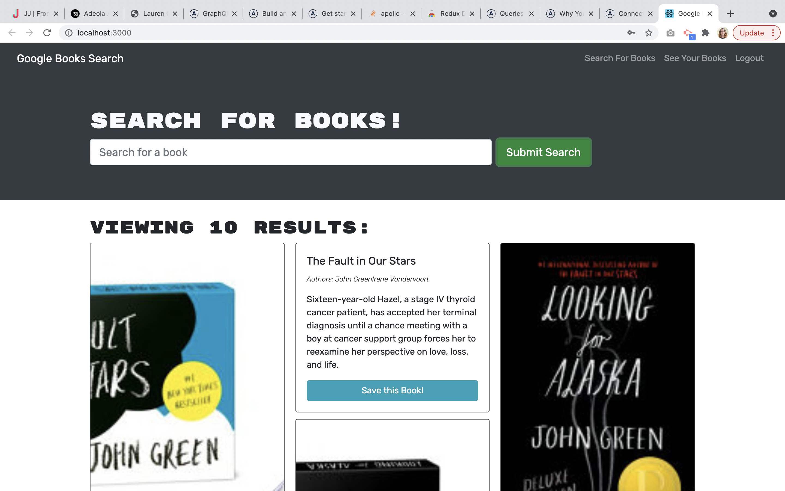
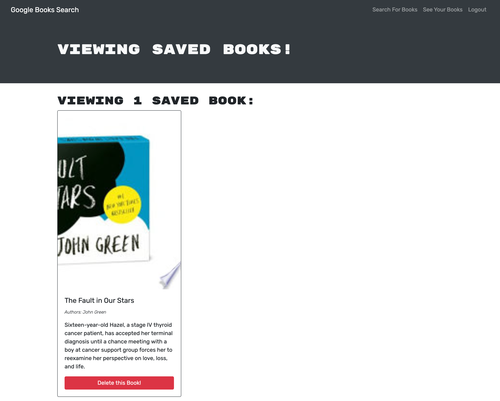

# book-search-engine

## Description

MERN application that allows the user to create an account and search for and save books.

## Table of Contents

- [Installation](#Installation)
- [Usage](#Usage)
- [Tests](#Tests)
- [Questions](#Questions)

## Installation

Required packages:

- node.js
- Client:
  - @apollo/client
  - @apollo/react-hooks
  - bootstrap.js
  - graphql.js
  - jwt-decode
- Server:
  - apollo-server-express
  - bcrypt
  - express.js
  - graphql.js
  - jsonwebtoken.js
  - mongoose.js

The user must run `npm i` in the root folder to install dependencies.

If in development mode, use the command `npm run develop` to start the servers. If accessing through the user's local device, the application can be found at `http://localhost:3000/`.

## Usage

This application allows a user to create an account or log in with an existing account. Upon logging in, the user can then search for books and retrieve their title, description, author(s), link, and image if applicable. The user can then click on that book's button to save it to their profile, which can be viewed under the 'See Your Books' navigation.

The deployed application can be found [here]().

## Tests

### Search Books

### Saved Books

## Questions

Do you have questions? Contact me here:

- [GitHub](https://github.com/laurenlgoss)
- [Email](laurenlgoss98@gmail.com)
